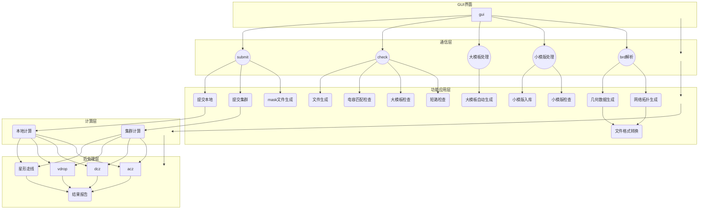

```mermaid
graph TB
    subgraph "GUI界面"
        direction TB
        gui
        gui_anchor[ ]
    end
    subgraph "通信层"
        direction TB
        brd_parse(("brd解析"))
        small_template(("小模版处理"))
        big_template(("大模板处理"))
        check(("check"))
        submit(("submit"))
        comm_anchor[ ]
    end
    subgraph "功能应用层"
        direction TB
        network_topo_gen("网络拓扑生成")
        geometry_data_gen("几何数据生成")
        file_format_convert("文件格式转换")
        small_template_check("小模版检查")
        small_template_db("小模版入库")
        big_template_gen("大模板自动生成")
        short_circuit_check("短路检查")
        big_template_check("大模板检查")
        capacitor_match("电容匹配检查")
        file_gen("文件生成")
        mask_gen("mask文件生成")
        cluster_submit("提交集群")
        local_submit("提交本地")
        func_anchor[ ]
    end
    subgraph "计算层"
        direction TB
        cluster_calc("集群计算")
        local_calc("本地计算")
        calc_anchor[ ]
    end
    subgraph "后处理层"
        direction TB
        acz
        dcz
        vdrop
        star_routing("星形走线")
        result_report("结果报告")
        post_anchor[ ]
    end
    %% 隐藏锚点样式
    style gui_anchor fill:transparent,stroke:transparent
    style comm_anchor fill:transparent,stroke:transparent
    style func_anchor fill:transparent,stroke:transparent
    style calc_anchor fill:transparent,stroke:transparent
    style post_anchor fill:transparent,stroke:transparent
    %% 强制层级从上到下排列（把计算层固定到功能层下面）
    gui_anchor --> comm_anchor
    comm_anchor --> func_anchor
    func_anchor --> calc_anchor
    calc_anchor --> post_anchor
    gui --> brd_parse
    gui --> small_template
    gui --> big_template
    gui --> check
    gui --> submit
    brd_parse --> network_topo_gen
    brd_parse --> geometry_data_gen
    network_topo_gen --> file_format_convert
    geometry_data_gen --> file_format_convert
    small_template --> small_template_check
    small_template --> small_template_db
    big_template --> big_template_gen
    check --> short_circuit_check
    check --> big_template_check
    check --> capacitor_match
    check --> file_gen
    submit --> mask_gen
    submit --> cluster_submit
    submit --> local_submit
    cluster_submit --> cluster_calc
    local_submit --> local_calc
    cluster_calc --> acz
    cluster_calc --> dcz
    cluster_calc --> vdrop
    cluster_calc --> star_routing
    local_calc --> acz
    local_calc --> dcz
    local_calc --> vdrop
    local_calc --> star_routing
    acz --> result_report
    dcz --> result_report
    vdrop --> result_report
    star_routing --> result_report
```